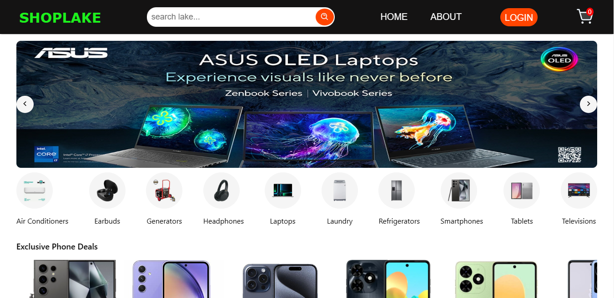
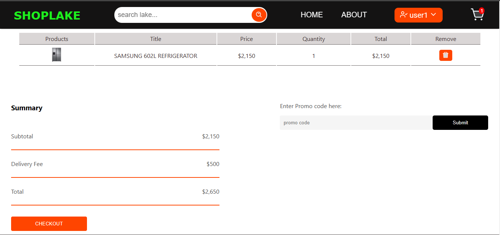
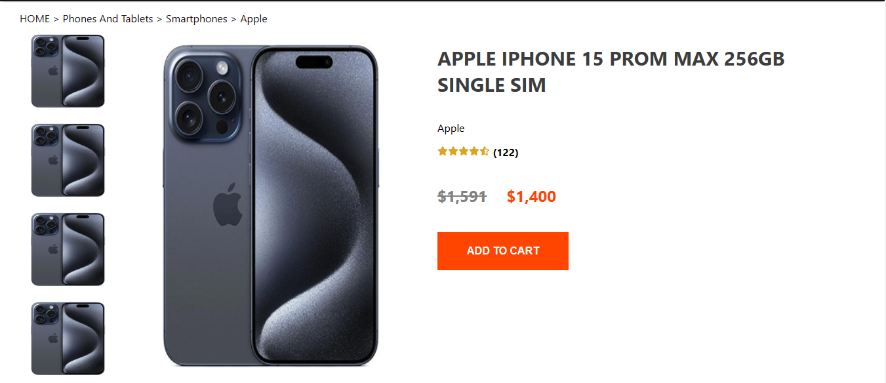
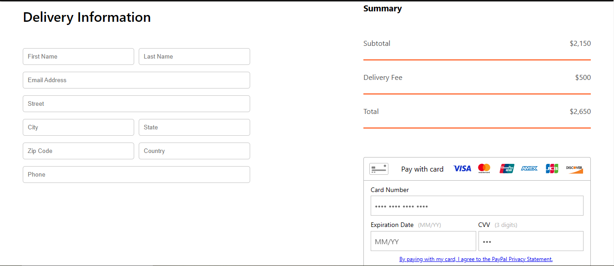
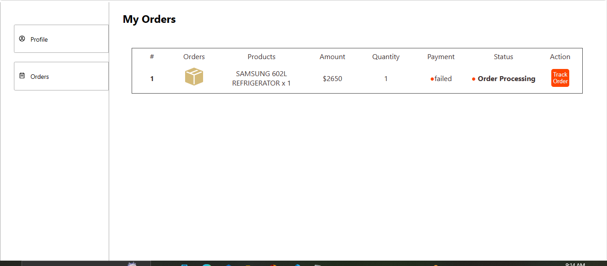

# INTRODUCTION TO SHOPLAKE
SHOPLAKE is a fullstack E-commerce website built using MERN(MongoDB, Express.js, React, Node.js) stack. It is designed for  online electronic retail, allowing users to browse and shop for various electronics products. The purpose of this project is to showcase my frontend and backend skills using MERN stack. This site includes lots of functionality like Admin for product stock and management and User dashboard and braintree payment gateway(sandbox) with credit card.

## UI Snapshots

### Hompage


### Cart Page


### Product Page


### Checkout Page


### Login Page


### User Orders Page


### Admin Dashboard Page


## TECH STACK

| Frontend       | Backend     |
|:---------------|:------------|
| React          | Node.js     |
|                | Express.js  |
|                | Mongo DB    |


### Client Side
```bash
$ cd clientside # go to client folder
$ npm install # install packages
$ npm start # run the client side statically with react-scripts
```

### Server Side
start the server

```bash
$ cd SERVERSIDE # go to the server folder
$ npm install # install all packages
$ npm run server # start the server
```
## Environment variables
The following variables are required to run the program in the SERVERSIDE directory.
```bash
lOCALHOST=Port_number
JWT_SECRET=your_jwt_secret
MONGOOSE_URL=your_mongoose_url
BRAINTREE_MERCHANTID=your_braintree_merchant_id
BRAINTREE_PUBLICKEY=your_braintree_public_key
BRAINTREE_PRIVATEKEY=your_braintree_private_key
```

## LOGIN ACCOUNTS

### For Admin:
Email: admin1@yahoo.com
Password: 22dd22

### For Admin Password Change:
Favorite word: adminword

### For User:
Email: user1@yahoo.com
Password: 224422
 ### For User Password Change
 Favorite word: userchange

## Contact

If you have any questions, feedback, or would like to connect, feel free to reach out to me.

- **Name:** Chibuzor Henry Amaechi
- **Email:** amaechihenrychibuzor@gmail.com

Feel free to contact me through any of the channels above. I'm open to collaborations and discussions related to Flutter development or any other projects.
 

